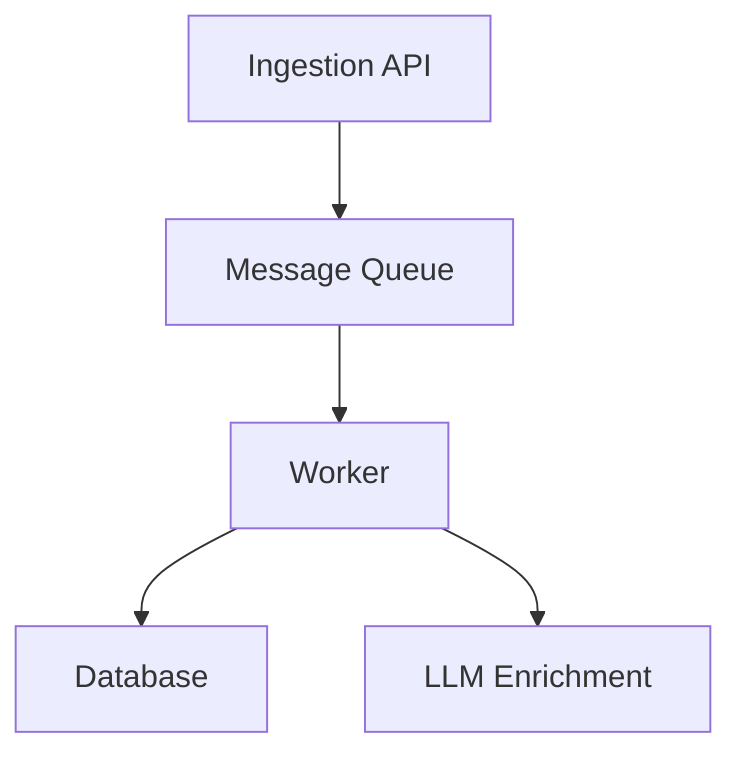

# Threat Telemetry Ingestion & Analyst Intelligence Gateway

## Architecture

## Prerequisites
- Node.js >= 18
- pnpm
- Docker

## Quick Start
1. `pnpm install`
2. `cp .env.example .env`
3. `pnpm run docker:up`
4. `pnpm run db:push`
5. `pnpm run dev:api`

## Tech Stack
- TypeScript
- Node.js
- pnpm Workspaces
- Zod
- Prisma
- PostgreSQL
